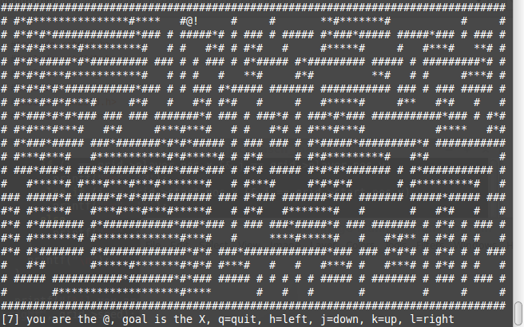

ascii_maze
==========

##How to Build
> make ascii_maze

(Does not depend on any libraries other than the standard C libraries.
Should work on any Unix'ish system, although I've only tested it on
Linux Mint Qiana.)

##How to run
> ./ascii_maze [seed_num]

seed_num is the seed number passed to rand(3).
The same number will yield the same maze every time.
Seed_num can be any positive integer,
otherwise a random seed based on the current time will be used.

##How to play
Vim movement keys (hjkl).  Think Pacman, but a maze.  A helpful strategy
is, as you "eat" the asterisks, you can effectively "close off" sections
of the maze that do not include the path to the exit, or that lead to dead
ends. Set your terminal to 80 columns x 24 lines (check with tput cols &
tput lines).

##How it works
The maze is basically a tree that has been "curled up" into a rectangular
grid.  Each node (cell on the grid) has up to four children (left, right,
up, down).  The algorithm used is a very simple [recursive depth first search](http://en.wikipedia.org/wiki/Maze_generation_algorithm#Depth-first_search)
which works like this (from Wikipedia):

1. Start at a particular cell and call it the "exit."
2. Mark the current cell as visited, and get a list of its neighbors. For each neighbor, starting with a randomly selected neighbor:
  1. If that neighbor hasn't been visited, remove the wall between this cell and that neighbor, and then recur with that neighbor as the current cell.

The entire screen is reprinted every time you move, and is intended to be
played on an 80x24 terminal.  It will probably work (but look weird) on a
larger terminal, and probably not work at all on a smaller one.  I'm working
on making it playable on any size terminal.  This is actually easy to do, the
code just needs to check the current terminal size, and then set the
grid->width and grid->height properties at runtime (instead of defining them
with preprocessor macros).

##What it looks like

